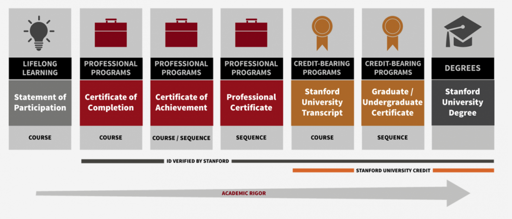

# [Deadlines](https://online.stanford.edu/calendar)

- NDO Summer Enrollment Opens on April 26th, 9 am, see: https://online.stanford.edu/faqs-graduate-enrollment.

- NDO Autumn Enrollment Opens **around** August 10th (date from previous academic year).

# Requirements

A minimum of 200 words and a maximum of 4000 characters is required for your application to be complete.

# Content

Describe your educational and/or professional reasons for applying to take courses under the Non Degree Option. Please also list the specific courses on your transcript which meet the course/certificate prerequisites for which you are applying. Where academic coursework is lacking, please identify relevant aspects of your work experience that do the same.

# Framing

#### Ideen

- Ich musste schon immer viele Aufgaben jonglieren:
  - Studiengang zwischen Econonomics und Informatics
  - theoretical studies at university vs. builder mentality at work
  - dev vs. ops

- AWS Zertifikate erwähnen
--> Where I am from, there is a widely held opinion to avoid certificates and generally paying much for education. Maybe this is due to the structure of Germany's education system. However, I do not share this opinion. I always closely aligned my professional work with continuous learning and testing (?).
I believe that high-quality education has its price, and I am willing to invest heavily into the most valuable asset for a young student in the start-up industry: knowledge.

---- 
#### START

- Programm benennen und auf Zugangsvoraussetzungen eingehen
- Startdatum benennen

- Uni benennen, Studiengan kurz beschreiben (interdisziplinär zwischen Wirtschaft und Informatik)

- Mein Schwerpunkt liegt auf Informatik
  --> siehe Bachelorarbeit zum Design von DSLs
  --> partially published as IEEE conference proceeding paper titled "A Cross-Disciplinary Language for Change Propagation Rules"

---
- Working at a startup for almost the whole undergraduate studies --> while it considerably stretched (?) the time, it also gave a einmalige (?) opportunity to build something

- 1 Satz zu Nesto: Digitalizing the German Hospitality Industry - with a focus on chain restaurants - since 2017 - reached 20 employees recently and are set to continue growth...
- My role: Member of the founding team - government-sponsored by the German ministry for ...Layed the foundation for today's scaling success by choosing AWS and building the cloud infrastructure and DevOps processes from ground up over last three years
- My formal role at Nesto is Cloud Solutions Architect. As such I am interested in building technical relationships with architects and builders all over the world. I do this by advocating for the Open Source idea in our company and try to open source as much as possible. I also love to get in touch with people on Stack Overflow. I would like to bring in this open and ... mindset to Stanford.

- Over the past months I drove IoT development at Nesto and developed a device which interfaces Point of Sales devices and brings financial data into the cloud in real-time. This data ingestion capability allows Nesto to approach almost any customer without requiring them to abandon their legacy equipment which would otherwise be cost-prohibitive in many cases.

As many traditional point of sale vendors were not amused by Nesto's efforts, I decided to implement a truly vendor-agnostic solution which treats any involved system as a black box and intercepts data during transport. I open-sourced the interceptor part under the umbrella project ProxySuite at GitHub.

Retrieving the financial data from various wired interfaces prooved (?) challanging, but securing the data transport into the cloud and similar processes at scale did even more so. That is where I think the Stanford Graduate certificate fits in perfectly. I want to deepen my knowledge in cybersecurity, meet like-minded people who worked on similar projects and are curious to lear about modern threats to these kind of systems. Thus I decided to take the following courses: CS140, CS144, CS155, CS244. I also looked at the IoT graduate certificate but think that the other certificate's focus on security and networking is more relevant for our project.

-----
Most importantly: Why Stanford?
- excellent reputation
- location: silicon valley is lucrative for start-up minded people
- best online learning infrastructure out there I have seen

-----

Map course requirements to experience at KIT

....

(rank them!)
The statement of purpose should state the following as primary intention: **move up in industry**, **learn with and from the best in the industry**, **move to the US and experience silicon valley's start-up industry (main benefit: mentality and language)**, **check if graduate studies in the US are an option for me**, **expand the network**.

# [Guidelines](https://ed.stanford.edu/sites/default/files/Statement-of-Purpose.pdf)

- Your statement should clearly have the purpose it’s supposed to have. 
- A statement of purpose is not a narrative of your accomplishments. 
- Your statement should be the right length. 
- Make absolutely sure that your statement contains no misspellings, grammatical or factual errors, and that your prose is as lucid as you can possibly make it.

# [Handbook](https://online.stanford.edu/non-degree-option-program)

